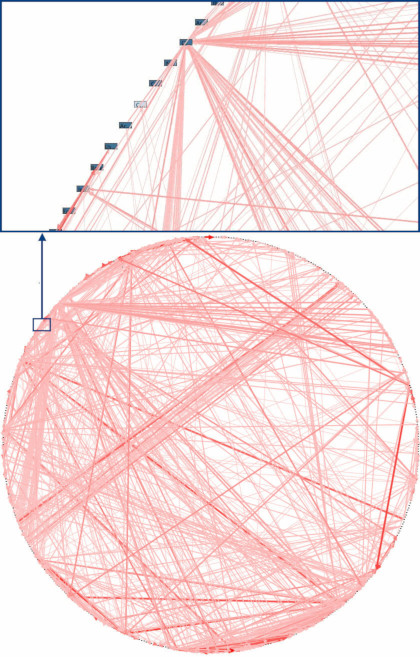

# 0.1 설계가 왜 잘못되는가?

우주의 엔트로피가 계속해서 증가하는 방향으로 팽창하듯이 소프트웨어 시스템도 혼돈 😱 상태로 향하려는 경향이 있습니다. 합리적으로 잘 계층화된 아키텍처도 결국에 온갖 코드가 엮인 복잡성으로 끝나는 경우를 볼 수 있습니다. 😭

* 그럼 이 복잡성을 제거하기 위해 코드를 마음대로 수정해버리면 어떻게 될까요?
  * 모든 요소가 다른 모든 요소와 결합(coupling 🔗)되어 있어서 시스템의 일부를 바꾸는 것은 위험합니다.&#x20;

<figure><figcaption>
<a href="https://oreil.ly/dbGTW">실제 의존성 다이어그램</a>
</figcaption></figure>

> 우주가 팽창할 때 무질서인 것처럼 보이지만, 크게 보면 나름의 질서를 지키고 있기 때문에 system(계)이 유지 되는 것처럼, 소프트웨어 역시 붕괴를 막으려면 정해진 방향으로 에너지를 소비해야 합니다.

출처: [Architecture Patterns with Python](https://github.com/cosmicpython/book/blob/master/introduction.asciidoc)
